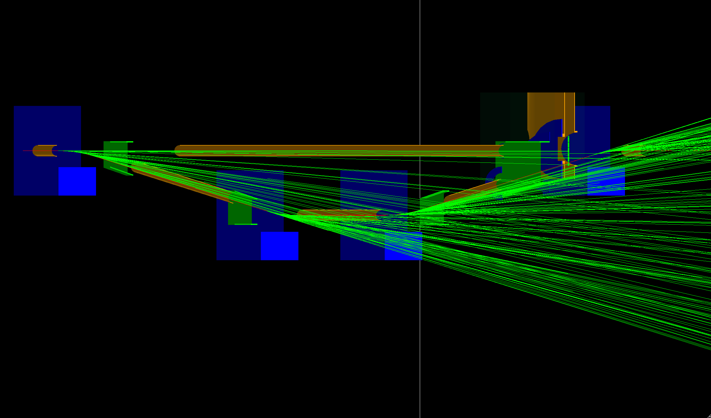

# Compton Simulation

[](https://github.com/pranphy/compton/actions)
[](LICENSE)

This repository contains a simulation for the Jefferson Lab Hall A compton polarimeter, built with ROOT and Geant4. It provides tools for simulating Compton scattering events and analyzing the resulting data.

[TOC]




*   **Compton Scattering Simulation:** Simulate Compton scattering phenomena using Geant4.
*   **ROOT Integration:** Utilize ROOT for data analysis and visualization.
*   **Customizable Geometry:** Define and modify detector geometries.
*   **Batch and Interactive Modes:** Run simulations with or without a graphical user interface.

## Dependencies

This project relies on the following major dependencies:

*   **ROOT:** A data analysis framework.
    *   Version: `6.32.04` (or higher)
    *   Download: [https://root.cern](https://root.cern/)
*   **Geant4:** A toolkit for simulating the passage of particles through matter.
    *   Version: `11.2.2` (or compatible)
    *   Download: [https://geant4.web.cern.ch/geant4/](https://geant4.web.cern.ch/geant4/)
*   **CMake:** A cross-platform build system. Ensure you have a recent version installed.

Please ensure these dependencies are installed and properly configured in your system environment.

## Installation

First, clone the repository:

```bash
git clone https://github.com/pranphy/compton.git
cd compton
```

## Building the Project

The project uses CMake for its build system. To compile:

```bash
mkdir -p build
cd build
cmake ..
make -j$(nproc)
```

This process will generate two executables in the `build/` directory:
*   `compton`: For running simulations.
*   `compoot`: For analyzing the output data.

## Running Simulations

The `compton` executable can be used to run simulations in both interactive and batch modes.

### Usage

```
Usage:
  compton [-g geometry] [-m macro] [-u session] [-r seed] [-t nthreads] [macro]
```

### Interactive Mode

To run in interactive mode with a graphical user interface:

```bash
./build/compton
```

This will open a GUI, loading the default geometry and executing `macros/runexample_vis.mac`, which configures the visualization.

### Batch Mode

To run a simulation in batch mode using a macro file:

```bash
./build/compton macros/test.mac
```

## Analyzing Output

The simulation output files can be analyzed using a standard ROOT installation. A detailed listing of the [output variables](doc/data-structure.md) is available for reference.

## Docs

- [Getting Started](doc/getting-started.md)
- [Data Structure](doc/data-structure.md)

## Contributing

Contributions are welcome! Please feel free to open issues or submit pull requests.

## License

This project is licensed under the MIT License.
