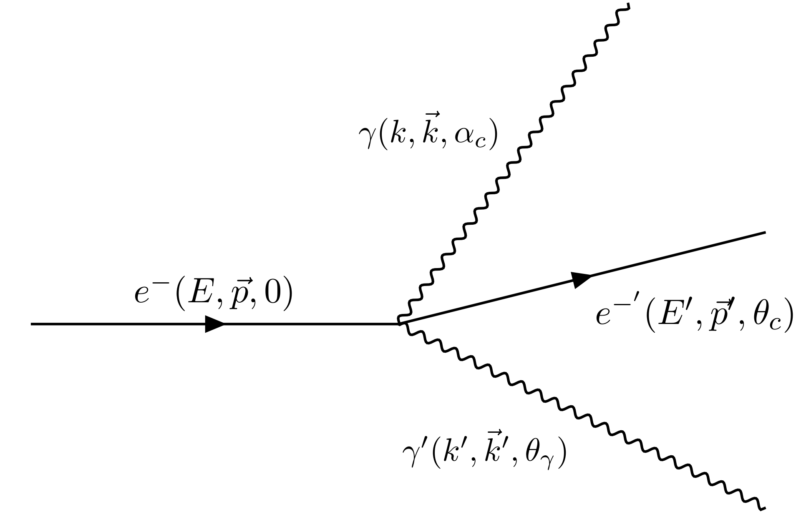
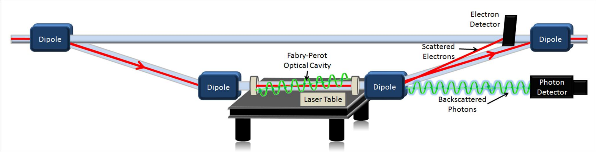

# Compton Scattering

Compton scattering occurs when a photon interacts with a charged particle, usually an electron, resulting in a decrease in the photon's energy and an increase in its wavelength. This phenomenon, discovered by Arthur Holly Compton in 1923, is a cornerstone of quantum mechanics and special relativity. The Compton effect is significant because it demonstrates the particle-like behaviour of light and provides insights into the interaction between photons and matter.

# Kinematics

- Incident electron \f$e\f$ with energy \f$E\f$ and momentum \f$\vec p = (0,0,p)\f$ along \f$\vec z\f$ axis.
- Incident photon \f$\gamma\f$ with energy \f$k\f$, incident angle \f$\alpha_e\f$ with respect to \f$\vec z\f$ and momentum \f$(0, -k \sin \alpha_e , - k \cos \alpha_e )\f$,
- Scattered electrons \f$e'\f$ with energy \f$E'\f$, scattering angle \f$\theta_e\f$ with respect to \f$\vec z\f$ and momentum \f$\vec p\prime  = (p\prime \sin \theta_c\sin\phi, p\prime\sin\theta_c\cos\phi, p\prime \cos\theta_c)\f$,
- Scattered photons \f$\gamma\prime\f$ with energy \f$k\prime\f$, scattering angle \f$\theta_\gamma\f$ with respect to \f$\vec z\f$ and momentum \f$\vec k\prime = (k\prime \sin \theta_\gamma, k\prime \sin\theta_\gamma\cos\phi, k\prime\cos\theta_\gamma)\f$.

- The incoming electron defines the \f$+z\f$ axis.
- The incoming photon approaches at an angle \f$\alpha_c\f$ relative to \f$+z\f$.
- The scattered photon emerges at angle \f$\theta_\gamma\f$ relative to \f$+z\f$.
- Everything lies in one plane (we set \f$\phi = 0\f$ without loss of generality).

Because the beams are not collinear, the initial state has **non‑zero transverse
momentum**, so the usual head‑on Compton formulas do not apply directly.
However, the process is still a **2‑body reaction**, so the full kinematics is
fixed by energy–momentum conservation.

---

## Define the 4‑momenta

Incoming electron (along \f$+z\f$):

\begin{align*}
p^\mu = (E,\; 0,\; 0,\; p), \qquad p = \sqrt{E^2 - m^2}.
\end{align*}

Incoming photon with crossing angle \f$\alpha_c\f$:

\begin{align*}
k^\mu = (k,\; 0,\; -k\sin\alpha_c,\; -k\cos\alpha_c).
\end{align*}

Scattered photon at angle \f$\theta_\gamma\f$:

\begin{align*}
k'^\mu = (k',\; 0,\; k'\sin\theta_\gamma,\; k'\cos\theta_\gamma).
\end{align*}

Scattered electron:

\begin{align*}
p'^\mu = p^\mu + k^\mu - k'^\mu.
\end{align*}

## Use the on‑shell condition for the final electron

The scattered electron must satisfy:

\begin{align*}
    p'^2 = m^2.
\end{align*}

Insert \f$p'^\mu = p^\mu + k^\mu - k'^\mu\f$:

\begin{align*}
    (p + k - k')^2 = m^2.
\end{align*}

Expand and use \f$p^2 = m^2\f$, \f$k^2 = 0\f$, \f$k'^2 = 0\f$:

\begin{align*}
    p\cdot k = p\cdot k' + k\cdot k'.
\end{align*}

This is the **master kinematic relation**.

## Compute the scalar products

###  Compute \f$p\cdot k\f$

\begin{align*}
p\cdot k &= Ek - \vec{p}\cdot\vec{k} \\\\
         &= Ek - (0,0,p)\cdot(0,-k\sin\alpha_c,-k\cos\alpha_c) \\\\
         &= k(E + p\cos\alpha_c).
\end{align*}

###  Compute \f$p\cdot k'\f$

\begin{align*}
p\cdot k' &= Ek' - \vec{p}\cdot\vec{k'} \\\\
          &= Ek' - p k'\cos\theta_\gamma \\\\
          &= k'(E - p\cos\theta_\gamma).
\end{align*}

###  Compute \f$k\cdot k'\f$

\begin{align*}
    k\cdot k' &= kk' - \vec{k}\cdot\vec{k'} \\\\
              &= kk'\left[1 + \sin\alpha_c\sin\theta_\gamma + \cos\alpha_c\cos\theta_\gamma\right].
\end{align*}

Use the identity:

\begin{align*}
    \cos(\alpha_c - \theta_\gamma) = \cos\alpha_c\cos\theta_\gamma + \sin\alpha_c\sin\theta_\gamma.
\end{align*}

Thus:

\begin{align*}
    k\cdot k' = kk'\left[1 + \cos(\alpha_c - \theta_\gamma)\right].
\end{align*}

##  Insert into the master relation

Start from:

\begin{align*}
    p\cdot k = p\cdot k' + k\cdot k'.
\end{align*}

Substitute all three scalar products:

\begin{align*}
    k(E + p\cos\alpha_c) = k'(E - p\cos\theta_\gamma) + kk'\left[1 + \cos(\alpha_c - \theta_\gamma)\right].
\end{align*}

Factor \f$k'\f$ on the right:

\begin{align*}
    k(E + p\cos\alpha_c) = k'\left[ E - p\cos\theta_\gamma  + k\left(1 + \cos(\alpha_c - \theta_\gamma)\right) \right].
\end{align*}

Solve for \f$k'\f$:

\begin{align*}
    k' = k\,\frac{E + p\cos\alpha_c}{ E - p\cos\theta_\gamma + k\left(1 + \cos(\alpha_c - \theta_\gamma)\right) }.
\end{align*}

Rewrite the denominator:

\begin{align*}
    E + k - p\cos\theta_\gamma + k\cos(\alpha_c - \theta_\gamma).
\end{align*}

Final result:

\begin{align*}
    k' = k \,\frac{E + p\cos\alpha_c}{ E + k - p\cos\theta_\gamma + k\cos(\alpha_c - \theta_\gamma) }.
\end{align*}

# Physical interpretation

- The numerator \f$E + p\cos\alpha_c\f$ encodes the **effective electron energy in the photon direction**.
- The denominator contains:
  - \f$E - p\cos\theta_\gamma\f$: electron recoil along the scattered photon direction,
  - \f$k\f$: the incoming photon energy,
  - \f$\cos(\alpha_c - \theta_\gamma)\f$: the **relative angle** between incoming and outgoing photons.

When \f$\alpha_c = 0\f$ (head‑on collision), this reduces to the familiar inverse‑Compton formula.

This is the fully general **lab‑frame** Compton‑scattering relation for arbitrary crossing angle.

## Implementation

The scattered photon energy \f$k^\prime\f$ is related to the scattered photon angle \f$\theta_\gamma\f$ by :

\begin{align*}
    k^{\prime}=k \frac{E+p \cos \alpha_c}{E+k-p \cos \theta_\gamma+k \cos \left(\alpha_c-\theta_\gamma\right)}.
\end{align*}

For photon incident angle \f$\alpha_c=0\f$, this equation can be simplified, using \f$\gamma=E / m\f$, leading to

\begin{align*}
    \frac{k^\prime}{k} \simeq \frac{4 a \gamma^2}{1+a \theta_\gamma^2 \gamma^2}
\end{align*}

where

\begin{align*}
    a=\frac{1}{1+\frac{4 k \gamma}{m}}=\frac{1}{1+\frac{4 k E}{m^2}}
\end{align*}

Now the scattering angle for photon can be simplified to

\begin{align*}
    \theta_\gamma= \sqrt{\left( 4 \frac{k}{k^\prime} - \frac{1}{4a\gamma^2} \right)}
\end{align*}

The maximum scattered photon energy \f$k_{\text {max }}^{\prime}\f$, corresponding to the minimum scattered electron energy \f$E_{\min }^{\prime}\f$, is reached for \f$\theta_\gamma=0\f$

\begin{align*}
    k_{\max }^{\prime} &= 4 a k \gamma^2 = 4 a k \frac{E^2}{m^2}, \\\\
    E_{\min }^{\prime} &= E-k_{\max }^{\prime}+k = E-4 a k \frac{E^2}{m^2}+k \simeq E-4 a k \frac{E^2}{m^2},
\end{align*}

while the minimum scattered photon energy \f$k_{\min }^{\prime}\f$, corresponding to the maximum scattered electron energy \f$E_{\max }^{\prime}\f$, is for \f$\theta_\gamma=\pi\f$,

\begin{align*}
    k_{\min }^{\prime}=k \\\\
    E_{\max }^{\prime}=E-k_{\min }^{\prime}+k=E .
\end{align*}

The photon scattering angle at which \f$k^{\prime}=k_{\max }^{\prime} / 2\f$ is

\begin{align*}
    \theta_{\gamma 1 / 2}=\frac{m}{E \sqrt{a}}=\frac{1}{\gamma \sqrt{a}}
\end{align*}

The scattered electron momentum \f$\mathbf{p}\f$ ' is related to the scattered electron angle \f$\theta_e\f$ by a second order equation:

\begin{align*}
    \begin{array}{r}
        p^{\prime 2}\left(C^2-B^2\right)-2 A B p^{\prime}+m^2 C^2-A^2=0 \\\\
        p^{\prime}=\displaystyle \frac{A B \pm C \sqrt{\left(A^2-m^2\left(C^2-B^2\right)\right)}}{C^2-B^2}
    \end{array}
\end{align*}

where

\begin{align*}
    \begin{array}{cc}
        A= & m^2+E k+k p \cos \alpha_c \\
        B= & p \cos \theta_e-k \cos \left(\theta_e-\alpha_c\right) \\
        C= & E+k
    \end{array}
\end{align*}

The maximum electron angle is obtained for \f$A^2 = m^2\left(C^2-B^2\right)\f$. For small photon incident angle and energy, one gets :

\begin{align*}
    \theta_e^{\max } \simeq 2 \frac{k}{m}
\end{align*}

## Compton Polarimetry at the Jefferson Lab Hall A
The Hall A Compton polarimeter is located in a chicane, about 15 meters long, just below the beamline. The electron-photon interaction point will be \f$\sim\f$15cm below the primary (straight-through) beamline. After the interaction point, the electron beam is bent about 2 degrees by the third chicane magnet and then restored to the main beamline. The scattered electrons are separated from the primary beam and detected using silicon microstrips, just before the fourth chicane magnet. Scattered photons pass through the third chicane magnet to be detected in a calorimeter. The photon target will be a 0.85 cm long Fabry-Perot cavity containing up to 2 kW of green (532 nm) light. The laser light is polarized using a quarter-wave plate, and can be toggled between opposite polarizations of highly circularly polarized light

Since this in non destructive measurement of polarization, the electron beam is sent back to its original direction. As a consequence of bending by the dipole magnets, synchrotron radiation is an unavoidable consequence. In the red arrows represent the produced synchrotron photons. Synchrotron radiation is unavoidable consequence of the way the polarimeter is constructed.

There is a paper that describes the numerical calculation for the expected synchrotron radiation [beneschSimpleModificationCompton2015]. In this paper they describe the technique with addition of shims to the dipole to mitigate the synchrotron radiation. The paper specifically describes the calculation done at the photon detector. Using Geant4-Simulation we will study the characterstics of the synchrotron radiation.

### Another
To express the scattered photon energy \f$k'\f$ in terms of the electron scattering angle \f$\theta_e\f$, start from the two key relations:

1. The usual Compton formula written in terms of the photon angle \f$\theta_\gamma\f$:
\begin{align*}
k'(\theta_\gamma)
=
k \,
\frac{E + p\cos\alpha_c}{
E + k - p\cos\theta_\gamma + k\cos(\alpha_c - \theta_\gamma)
}.
\end{align*}

2. The relation between the electron and photon scattering angles from momentum conservation:
\begin{align*}
\tan\theta_e
=
\frac{
k' \sin\theta_\gamma
}{
p - k' \cos\theta_\gamma
}.
\end{align*}

This second equation allows you to eliminate \f$\theta_\gamma\f$.
Solve it for \f$\cos\theta_\gamma\f$ in terms of \f$\theta_e\f$ and \f$k'\f$.
Using
\begin{align*}
\sin\theta_\gamma &= \sqrt{1 - \cos^2\theta_\gamma},
\end{align*}
the equation becomes an algebraic (typically quadratic) equation for \f$\cos\theta_\gamma\f$.

Substitute the resulting expression \f$\cos\theta_\gamma(\theta_e, k')\f$ into the Compton formula for \f$k'(\theta_\gamma)\f$.
This produces a single equation:
\begin{align*}
F\bigl(k';\,\theta_e, E, p, k, \alpha_c\bigr) = 0,
\end{align*}
which can be solved explicitly for \f$k'\f$.
The result is the desired expression \f$k'(\theta_e)\f$.

Parameter meanings:
- \f$k\f$: initial photon energy
- \f$k'\f$: scattered photon energy
- \f$E\f$: initial electron energy
- \f$p\f$: initial electron momentum
- \f$\alpha_c\f$: photon incident angle relative to the electron direction
- \f$\theta_\gamma\f$: photon scattering angle
- \f$\theta_e\f$: electron scattering angle

## Initial Angle polar

If the initial electron is no longer along the \f$z\f$-axis, but has its own polar direction, the clean way to handle Compton kinematics is:

1. Rotate into a frame where the electron defines the \f$z\f$-axis.
2. Do all the Compton kinematics there (exactly as before).
3. Rotate the final momenta back to the original lab frame.

In other words: the formulas for \f$k'(\theta_e)\f$ do not fundamentally change — you just change what you mean by “\f$\theta_e\f$” and “\f$\theta_\gamma\f$”.

### Define the initial electron direction

Let the initial electron have polar and azimuthal angles \f$\Theta_e^{(0)}, \Phi_e^{(0)}\f$ in the lab frame, with momentum magnitude \f$p\f$ and energy \f$E\f$. Its 3-momentum is
\begin{align*}
\vec{p}
&=
p
\begin{pmatrix}
\sin\Theta_e^{(0)} \cos\Phi_e^{(0)} \\
\sin\Theta_e^{(0)} \sin\Phi_e^{(0)} \\
\cos\Theta_e^{(0)}
\end{pmatrix}.
\end{align*}

The initial photon has energy \f$k\f$ and some direction \f$(\Theta_\gamma^{(0)}, \Phi_\gamma^{(0)})\f$ in the lab.

### Rotate to the electron-aligned frame

Construct a rotation \f$R\f$ that sends the electron direction to the new \f$z\f$-axis:
\begin{align*}
R \,\hat{p}
&= \hat{z},
\end{align*}
where \f$\hat{p} = \vec{p}/|\vec{p}|\f$.

Apply this rotation to all 3-momenta:
\begin{align*}
\vec{p}^{\,*} &= R \vec{p} = (0,0,p), \\
\vec{k}^{\,*} &= R \vec{k}, \\
\vec{p'}^{\,*} &= R \vec{p'}, \\
\vec{k'}^{\,*} &= R \vec{k'}.
\end{align*}

In this rotated frame (denoted by \f$*\f$), the electron is along \f$+z\f$, and the photon has some incident angle \f$\alpha_c^{*}\f$ with respect to \f$+z\f$. Now you can use the same kinematics as in the “electron-along-\f$z\f$” case.

### Use the standard Compton relations in the electron-aligned frame

In the electron-aligned frame, you can write the scattered photon energy as a function of the photon scattering angle \f$\theta_\gamma^{*}\f$:
\begin{align*}
k'(\theta_\gamma^{*})
&=
k \,
\frac{E + p\cos\alpha_c^{*}}{
E + k - p\cos\theta_\gamma^{*} + k\cos(\alpha_c^{*} - \theta_\gamma^{*})
}.
\end{align*}

The relation between the electron and photon scattering angles in this frame is
\begin{align*}
\tan\theta_e^{*}
&=
\frac{
k' \sin\theta_\gamma^{*}
}{
p - k' \cos\theta_\gamma^{*}
}.
\end{align*}

To express \f$k'\f$ in terms of the electron scattering angle \f$\theta_e^{*}\f$, you proceed exactly as before:

1. Solve the angle relation for \f$\cos\theta_\gamma^{*}\f$ in terms of \f$\theta_e^{*}\f$ and \f$k'\f$.
2. Substitute \f$\cos\theta_\gamma^{*}(\theta_e^{*}, k')\f$ into the expression for \f$k'(\theta_\gamma^{*})\f$.
3. Solve the resulting algebraic equation for \f$k'\f$, giving \f$k'(\theta_e^{*})\f$.

### Relate \f$\theta_e^{*}\f$ to the lab electron angle

The angle \f$\theta_e^{*}\f$ is defined with respect to the electron’s initial direction (the new \f$z\f$-axis).
If the scattered electron has lab-frame direction \f$(\Theta_e', \Phi_e')\f$, then in the electron-aligned frame:
\begin{align*}
\cos\theta_e^{*} &= \hat{p} \cdot \hat{p'},
\end{align*}
where \f$\hat{p}\f$ is the unit vector along the initial electron direction and \f$\hat{p'}\f$ is the unit vector along the scattered electron direction, both in the lab frame. Explicitly:

\begin{align*}
\cos\theta_e^{*} &= \sin\Theta_e^{(0)} \sin\Theta_e' \cos(\Phi_e' - \Phi_e^{(0)}) \cos\Theta_e^{(0)} \cos\Theta_e'.
\end{align*}

Thus, given the lab electron scattering angles \f$(\Theta_e', \Phi_e')\f$ and the initial electron direction \f$(\Theta_e^{(0)}, \Phi_e^{(0)})\f$, you can compute \f$\theta_e^{*}\f$, then use your \f$k'(\theta_e^{*})\f$ formula.

### Summary of what changes

- The **functional form** of \f$k'\f$ in terms of the electron scattering angle is unchanged; it is still derived in the frame where the electron defines the \f$z\f$-axis.
- What changes is the **interpretation** of the angle:
  - Previously, \f$\theta_e\f$ was the electron angle with respect to the lab \f$z\f$-axis.
  - Now, the natural angle in the Compton formulas is \f$\theta_e^{*}\f$, the electron angle with respect to the **initial electron direction**.
- You connect lab angles to \f$\theta_e^{*}\f$ via a simple dot product:
\begin{align*}
\cos\theta_e^{*}
&=
\hat{p} \cdot \hat{p'}.
\end{align*}

Once you have \f$\theta_e^{*}\f$, you plug it into the same \f$k'(\theta_e^{*})\f$ expression you would use in the electron-aligned frame.

# Solving for the photon scattering angle \f$\theta_\gamma\f$ in terms of \f$k'/k\f$

We start from the general Compton formula with nonzero crossing angle \f$\alpha_c\f$:
\begin{align*}
k' = k \,\frac{E + p\cos\alpha_c}{
E + k - p\cos\theta_\gamma + k\cos(\alpha_c - \theta_\gamma)
}.
\end{align*}

Define the ratio
\begin{align*}
\rho \equiv \frac{k'}{k}.
\end{align*}

Then
\begin{align*}
\rho &= \frac{E + p\cos\alpha_c}{
E + k - p\cos\theta_\gamma + k\cos(\alpha_c - \theta_\gamma)
}.
\end{align*}

Invert:
\begin{align*}
    \rho\left(E + k - p\cos\theta_\gamma + k\cos(\alpha_c - \theta_\gamma)\right) = E + p\cos\alpha_c.
\end{align*}

Expand the cosine:
\begin{align*}
    \cos(\alpha_c - \theta_\gamma) = \cos\alpha_c\cos\theta_\gamma + \sin\alpha_c\sin\theta_\gamma.
\end{align*}

So:

\begin{align*}
\rho E + \rho k  - \rho  p\cos\theta_\gamma r + k\left(\cos\alpha_c\cos\theta_\gamma + \sin\alpha_c\sin\theta_\gamma\right) = E + p\cos\alpha_c.
\end{align*}

Group \f$\cos\theta_\gamma\f$, \f$\sin\theta_\gamma\f$, and constants:

\begin{align*}
\underbrace{\left(-\rho p + \rho k\cos\alpha_c\right)}_{A}\cos\theta_\gamma + \underbrace{\rho k\sin\alpha_c}_{B}\sin\theta_\gamma + \underbrace{\left(\rho E + \rho k - E - p\cos\alpha_c\right)}_{C} = 0.
\end{align*}

So we have the generic form
\begin{align*}
    A\cos\theta_\gamma + B\sin\theta_\gamma + C = 0,
\end{align*}
with
\begin{align*}
    A &= -\rho p + \rho k\cos\alpha_c, \\\\
    B &= \rho k\sin\alpha_c, \\\\
    C &= \rho E + \rho k - E - p\cos\alpha_c.
\end{align*}

# Solving the trigonometric equation

We rewrite
\begin{align*}
A\cos\theta_\gamma + B\sin\theta_\gamma = -C.
\end{align*}

Define
\begin{align*}
    R &= \sqrt{A^2 + B^2}, \\\\
    \delta &\equiv \arctan2(B, A),
\end{align*}
so that
\begin{align*}
    A &= R\cos\delta, \\\\
    B &= R\sin\delta.
\end{align*}

Then
\begin{align*}
    A\cos\theta_\gamma + B\sin\theta_\gamma
    &= R\cos\delta\cos\theta_\gamma + R\sin\delta\sin\theta_\gamma \\\\
    &= R\cos(\theta_\gamma - \delta).
\end{align*}

So the equation becomes
\begin{align*}
    R\cos(\theta_\gamma - \delta) = -C.
\end{align*}

Therefore
\begin{align*}
    \cos(\theta_\gamma - \delta) = -\frac{C}{R},
\end{align*}
and the solutions for \f$\theta_\gamma\f$ are
\begin{align*}
    \theta_\gamma = \delta \pm \arccos\!\left(-\frac{C}{R}\right),
\end{align*}
with
\begin{align*}
    A &= -\rho p + rk\cos\alpha_c, \\\\
    B &= \rho k\sin\alpha_c, \\\\
    C &= \rho E + \rho k - E - p\cos\alpha_c, \\\\
    R &= \sqrt{A^2 + B^2}, \\\\
    \delta &= \arctan2(B, A), \\\\
    \rho &= \frac{k'}{k}.
\end{align*}

In practice, you then pick the branch (the $\pm$) that matches the physical
scattering configuration (forward vs backward, small vs large angle, etc.).

