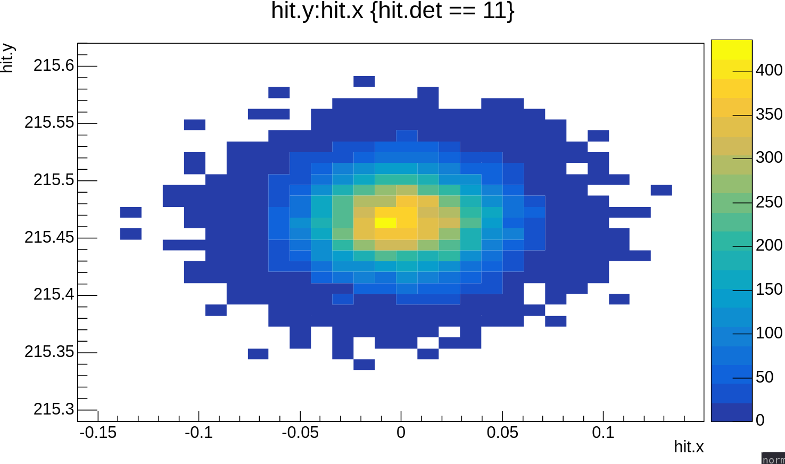

# Getting Started
Say you want to simulate 1000 beam events.


##  Create a macro
Then create a macro `macros/batch.mac` with the following content.
```mac


/compton/geometry/setfile geometry/compton/ComptonGeometry.gdml
/compton/parallel/setfile geometry/compton/ComptonParallel.gdml

/compton/physlist/synchrotron/enable

/compton/field/add 1 map_directory/20/dipole_magnetic_field_20_1.txt
/compton/field/add 2 map_directory/20/dipole_magnetic_field_20_2.txt
/compton/field/add 3 map_directory/20/dipole_magnetic_field_20_3.txt
/compton/field/add 4 map_directory/20/dipole_magnetic_field_20_4.txt
/compton/field/globalscale 0.97886

/run/initialize


/compton/evgen/set beam
/compton/evgen/beam/origin 0 215.49 -9849.76 mm
/compton/evgen/beam/beamene 11.0 GeV
/compton/evgen/beam/beamcurr 65 microampere
/compton/evgen/beam/originspread 30 30 0 um
/compton/evgen/beam/direction 0 0.0000 1


/compton/SD/disable_all
/compton/SD/enable 41
/compton/SD/detect lowenergyneutral 41
/compton/SD/detect secondaries 41
/compton/SD/detect boundaryhits 41


/compton/filename comptonout_beam_events.root
/compton/seed 42

/run/beamOn 1000
```


## Run the macro
Then run the simulation with

```bash
./build/compton macros/batch.mac
```

This will output a root file called `comptonout_beam_events.root` in the current directory.

@warning in the `macros/batch.mac` we gave the path to the gdml files relative to current directory. So we have to make sure that the executaion starts from the location where the geometry files are accessible. Since in the source directory there is `geometry/` directory which has the gdml files, we execute it from the source directory specifying the relative path of the executable which is at `./build/compton`.


## Open root file
Open the root file with the `compoot` executable that is inside the build directory.


```bash
user@host:~/compton/ $ ./build/compoot comptonout_beam_events.root

   ------------------------------------------------------------------
  | Welcome to ROOT 6.38.00                        https://root.cern |
  | (c) 1995-2025, The ROOT Team; conception: R. Brun, F. Rademakers |
  | Built for linuxx8664gcc on Feb 21 2026, 14:12:21                 |
  | From tags/6-38-00@6-38-00                                        |
  | With c++ (GCC) 15.2.1 20260209 std201703                         |
  | Try '.help'/'.?', '.demo', '.license', '.credits', '.quit'/'.q'  |
   ------------------------------------------------------------------

compoot [0]

```

This will put you into interactive root session with the file open. The default tree name is `T` and you can start making plots with the data from this tree.


## Make plots

Say you want to know the distribution of beam electrons just before the first magnet:
```cpp
compoot[1] T->Draw("hit.y:hit.x","hit.det == 10","colz")
```



This plot shows that the primary beam is centered at \f$x=0\f$ and at \f$y=215.49\f$mm. The primary beam is generated with a given position and an spread of 30\f$\mu\f$m gaussian spread, which is wat we see before the entrance of first magnet. The virtual plane in front of first magnet has detector id `10`.
