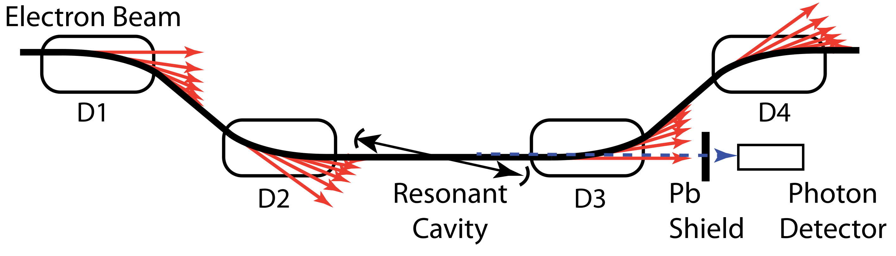
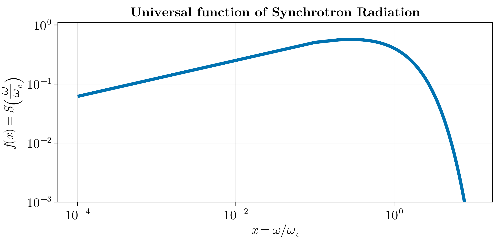

# Synchrotron Radiation

## Introduction

Synchrotron radiation is the unavoidable consequence of magnetic field used the bend the beam in the chicane.

In the diagram above, the red arrows indicate the generation of the synchrotron radiation. These radiation are generally low enrgy photons (<1MeV) but they are produced in a copious number.

Synchrotron radiation from relativistic charged particles is emitted over a wide spectrum of photon energies. The basic characteristics of this spectrum can be derived from simple principles as suggested in [reference]. For an observer synchrotron light has the appearance similar to the light coming from a light house. Although the light is emitted continuously an observer sees only a periodic flash of light as the aperture mechanism rotates in the lighthouse. Similarly, synchrotron light emitted from relativistic particles will appear to an observer as a single flash if it comes from a bending magnet in a transport line passed through by a particle only once or as a series of equidistant light flashes as bunches of particles orbit in a circular accelerator.

The synchrotron radiation spectrum from relativistic particles in a circular acclerator is made up of harmonics of the particle revolution frequency \f$\omega_0\f$ with values up to and beyond critical frequency. Generally,a real synchrotron radiation beam from, say a storagte right, will not display this harmonic structure. The distance between harmonics is extremely small compared to the extracted photon frequencies in the VUV and x-ray regime wile the line width is due to energy spread and beam emmittance[reference].

For a single pass of particles through a bending magnet in a abeam transport line we abserve the same spectrum. Specifically, the maximum frequency is the same assuming similar parameters. Synchrotron radiation is emitted in a particular spatial and spectral distribution. Both of which will be derived[reference].

%For highly relativistic particles the synchrotron

$$
E_c = \frac{3\hbar c}{2 r} \gamma^3
$$

Eq. \eqref{eq:critical-energy} expresses the critical energy of the synchrotron radiation as a function of the beam energy and the bending radius. The critical energy is the energy of emitted synchrotron photons which splits the number of photons emitted above and below that energy in half.

## Universal function of Synchrotron radiation
The spectral distribution depends only on the critical frequency \f$\omega_c\f$, the total radiation power, and a purely mathematical function. This result has been derived originally by Ivanenko and Sokolov and independently by Schwinger . Specifically, it should be noted that the synchrotron radiation spectrum, if normalized to the critical frequency, does not depend on the particle energy and is represented by the universal function shown in Fig. \eqref{fig:sync-radiation-universal-func}. The energy dependence is contained in the cubic dependence of the critical frequency acting as a scaling factor for the real spectral distribution[reference].

$$
S \left( \frac{\omega}{\omega_c} \right)  = \frac{9 \sqrt{3}}{8\pi} \frac{\omega}{\omega_c} \int\limits_{\omega / \omega_c}^{\infty} K_{5 / 3}(x) dx
$$

Here \f$K_{5 / 3}(x)\f$ is the modified Bessel function of the second kind. (Somewhere I have seen that this is also referred as the Bessel function of third kind. But ``modified Bessel function" of the second kind seems to be the most common nomenclature for this).

This is a purely mathematical distribution function. properly normalized to 1.  This means, in units of the critical energy, which is determined by the beam energy and the matnetic field, the synchotron radiation spectrum follows the same spectrum.

So this characteristic function can be used to describe the synchrotron radiation spectrum.

## Synchrotron Radiation Spectrum
Now that we have the rate of synchrotron photon from the synchrotron radiation we can express the rate of synchrotron radiation at a small angle dθ as:

\begin{align*}
\frac{d\bar{N}}{d\theta} = \frac{4\alpha}{9} \gamma \frac{I}{e} \frac{\Delta\omega}{\omega} S \left( \frac{\omega}{\omega_c} \right)
\end{align*}

In this equation the term \f$I/e\f$ is just the number of electrons per second. The paper [reference] rearranges this expression without the mention of the universal function of synchrotron radiation as:

\begin{align} \label{eq:sync-rate-paper}
\frac{d^2N}{dE_ \gamma d\theta} = \frac{\sqrt{3}}{2\pi} \frac{\alpha\gamma}{E_c} \int\limits_{E_\gamma/E_c}^{\infty} K_{5/3}(x) dx.
\end{align}

The two equations are the same of course. The paper takes Δω on Eq. \eqref{eq:sync-rate-book} to the left and expresses as differential.

So the Eq. \eqref{eq:sync-rate-paper} tells us the derivative. Now to integrate over the z.

\begin{align*}
\frac{dN_\gamma}{dE_\gamma} = \int_0^{\theta_\text{max}} \frac{dN_\gamma}{dE_\gamma d\theta} d\theta
\end{align*}

Bt we have
\begin{align*}
\theta(z) = \frac{p_e}{e B_\perp(z)} \Rightarrow d\theta = -\frac{p_e B'(z)}{2eB(z)^2} dz
\end{align*}

But θ = θ_max at z= ∞ and θ = 0 at z = -∞. This makes the integral

\begin{align*}
\frac{dN_\gamma}{dE_\gamma} = -\int_{-\infty}^{\infty} \frac{dN_\gamma}{dE_\gamma d\theta} \frac{p_e B'(z)}{2eB(z)^2} dz
\end{align*}

\begin{align}\label{eq:final-dn-de}
\frac{dN_\gamma}{dE_\gamma} = -\int_{-\infty}^{\infty} \frac{\sqrt{3}}{2\pi} \frac{\alpha\gamma}{E_c} \left(\int\limits_{E_\gamma/E_c(z)}^{\infty} K_{5 /3}(x) dx \right) \frac{p_e B'(z)}{2eB(z)^2} dz
\end{align}

Eq. \eqref{eq:final-dn-de} is not the easiest to calculate analytically. So a numerical integral was written in julia pgrammilng language with the `Integral` package.

